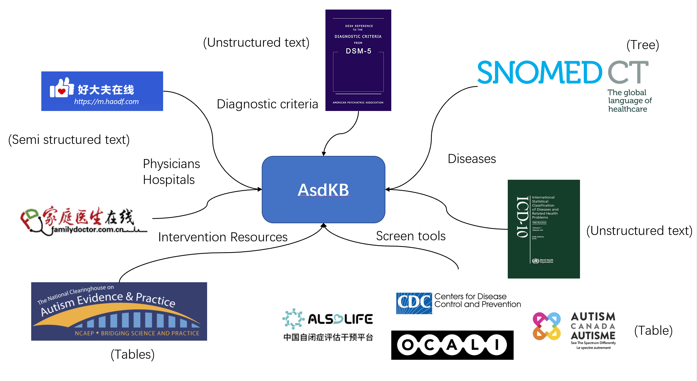
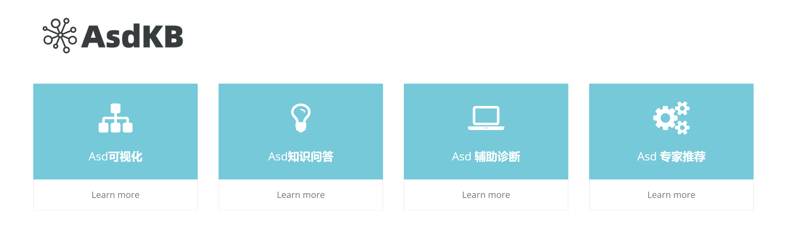

# AsdKB: A Chinese Knowledge Base for Early Screening and Diagnosis of Autism Spectrum Disorder

## Project Structure

- Ontology: [ontology.owl](./ontology/ontology.owl)
- Source for ontology and ontology generation script: [ontology/](./ontology/)
- Source for instances: [instance/](./instance/)
- Manual ontology mapping to UMLS and ADAR: [mapping/](./mapping/)
- Other sample docs and images: [docs/](./docs/)

## RDF Dumps

- 

## Namespace

- class: <http://w3id.org/asdkb/ontology/class/>
- dataproperty: <http://w3id.org/asdkb/ontology/dataproperty/>
- objectproperty: <http://w3id.org/asdkb/ontology/objectproperty/>
- instance: <http://w3id.org/asdkb/instance/>

### Demo

We developed a prototype system at [http://asdkb.org.cn/](http://asdkb.org.cn/).

